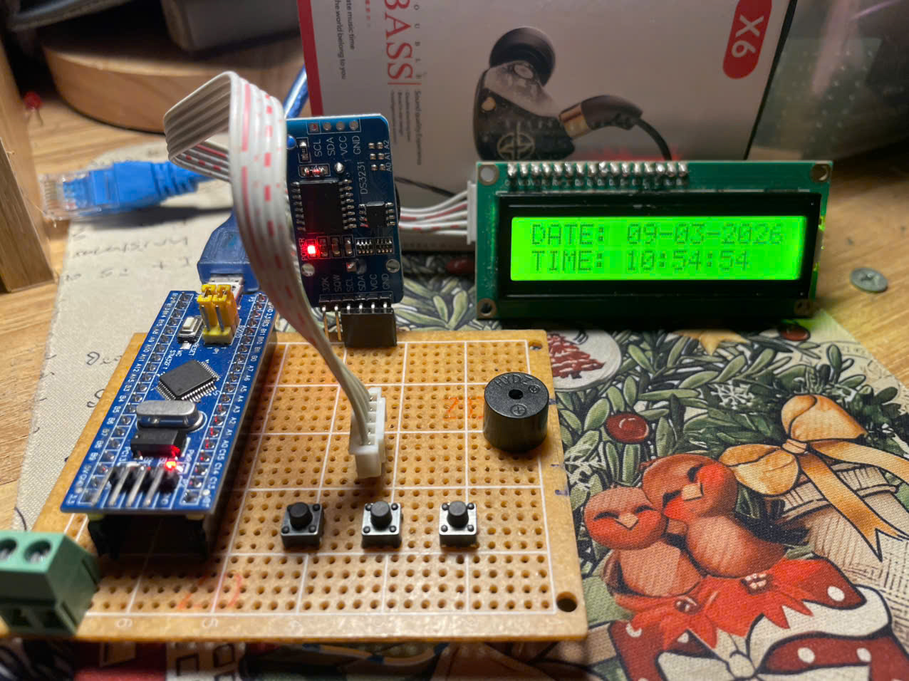
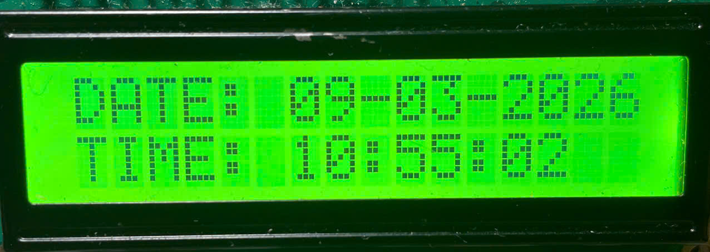
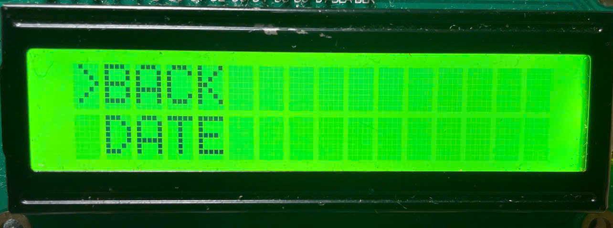
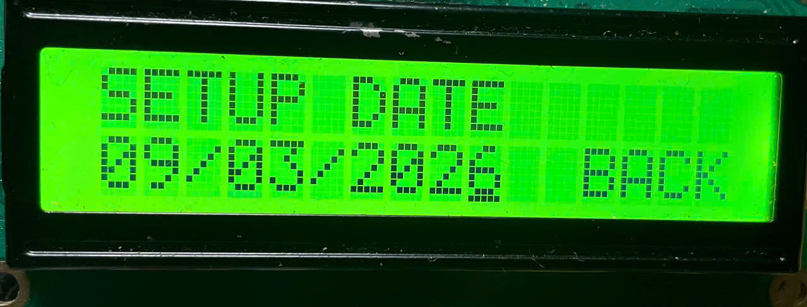
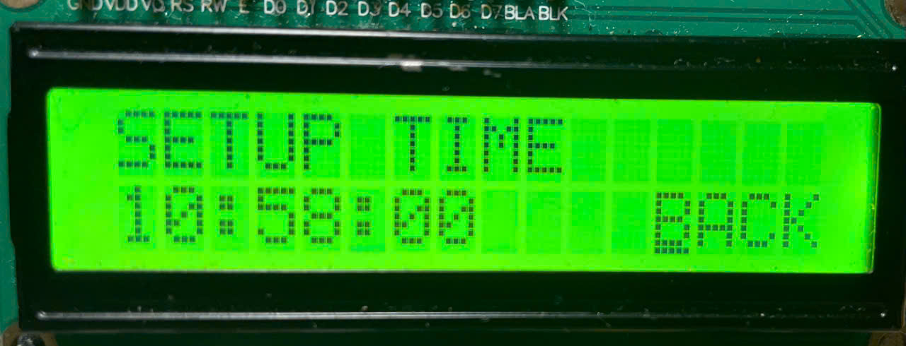
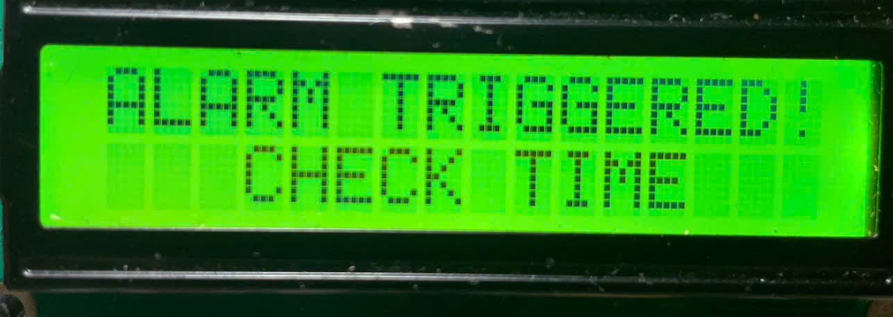
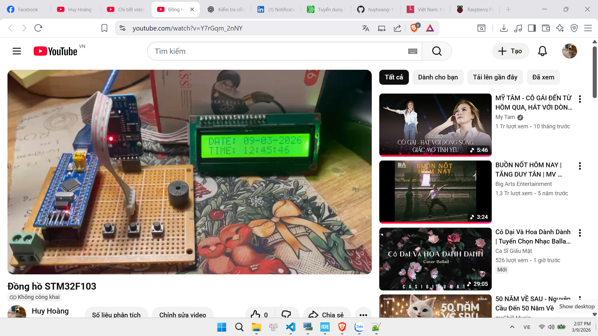

# STM32F103 RTC + LCD Menu Firmware

This repository contains firmware for an STM32F103-based clock/alarm device using:
- DS3231 RTC (I2C).
- 16x2 I2C LCD (LiquidCrystal_I2C style).
- Three buttons for menu: UP, DOWN, MENU.
- Buzzer for alarms notification. 

The firmware implements a menu-driven user interface for configuring date, time, and multiple alarms directly on the device.

---

## Overview

The firmware implements:
- Main screen showing DATE and TIME (from DS3231).
- A top menu (BACK / DATE / TIME / ALARM).
- Submenus for setting date, setting time and configuring up to 5 alarms.
- Editing UI that moves a cursor (using LCD cursor on) and increments/decrements fields according to the "contro" index.
- Alarm checking and buzzer output when an alarm triggers.
---

## Features

- Read/write RTC (DS3231) via I2C.
- 16x2 I2C LCD UI with cursor used for editing fields.
- Menu system: BACK, SET DATE, SET TIME, ALARM.
- Up to 5 alarms (manual editing UI present).
- Buzzer notification on alarm.
- Cursor-based field editing system

---

## Hardware wiring

- STM32F103 (Blue Pill) — I2C1 pins:
  - PB6 -> I2C1 SCL
  - PB7 -> I2C1 SDA
  - (Ensure DS3231 and LCD share the same I2C bus and addresses.)
- Buttons (active-low with MCU internal pull-ups):
  - PA5 -> UP
  - PA6 -> DOWN
  - PA4 -> MENU
  - Buttons other side -> GND
- Buzzer:
  - PA8 -> Buzzer+ (other side -> GND)
- Common ground: connect DS3231, LCD and MCU grounds together.

Note: If using external pull-ups on I2C lines, 4.7kΩ is typical.

---

## Important code notes & gotchas

- DS3231 year handling
  - DS3231 stores year as two BCD digits (0..99). Always pass only the last two digits (year % 100) when calling Set_Time. Passing a full four-digit year will produce incorrect BCD writes and wrong reads.
  - The code includes Set_Time(..., (uint8_t)(namtong % 100)) in relevant places to avoid this bug.

- Set_Time parameter order
  - DS3231 expects the register sequence seconds, minutes, hours, dayofweek, dom, month, year. Ensure you call Set_Time with that order. Earlier mistakes (passing hours,minutes,seconds) will corrupt RTC data.

- Debounce & button logic
  - We discussed and optionally implemented per-button debounce using a small software structure. If you find button behavior noisy, enable/use the per-button debounce code (DEBOUNCE_MS) and increase the per-press HAL_Delay (post-press delay).

- Writes during editing
  - Some versions of the port wrote to the RTC in the display loop while the user is still editing. That can cause intermediate invalid values to be written (e.g. month temporarily 19) and then appear wrong after a read. Recommended approach is:
    - Only write to RTC when user confirms (exits edit mode).
    - The code currently writes during display to mimic original behavior.

- hi2c1 symbol
  - The I2C handle `hi2c1` must be defined exactly once in the project. If you get a linker "undefined reference to hi2c1" — add a definition (I2C_HandleTypeDef hi2c1;) or ensure your CubeMX-generated I2C file (e.g., i2c.c / MX_I2C1.c) provides it.
  - If you get "multiple definition of hi2c1", remove duplicate definitions and keep a single authoritative one.

---

## Build & Flash (quick)

Prerequisites:
- STM32CubeMX project for STM32F103 (or HAL/Makefile setup).
- arm-none-eabi toolchain.

Typical compile (example from your environment):
- Build object files with arm-none-eabi-gcc (STM32CubeIDE does this automatically).
- Link via arm-none-eabi-ld / via IDE.

If using command line and Makefile:
- Ensure include paths reference:
  - CMSIS device headers
  - Core/Inc
  - HAL driver includes
- If using i2c-lcd.c that references hi2c1, make sure `hi2c1` is defined/declared once.

Flash:
- Use ST-Link (ST-LINK CLI / STM32CubeProgrammer) or your preferred flashing tool.
- If you have a custom bootloader, flash the application to the correct bank/offset.

---

## Usage / UI guide

- Boot: device starts and shows:
  - Line 0: DATE: DD-MM-20YY
  - Line 1: TIME: HH:MM:SS

- Menu:
  - Press MENU to open top menu.
  - Use UP/DOWN to move menu cursor.
  - MENU to select.

- SET DATE:
  - Navigate to DATE -> SETUP DATE.
  - Editing fields are chosen by `contro` index; UP/DOWN change the currently selected field according to original mapping.
  - Confirm/exit as per original sketch behavior (MENU toggles between menu/edit modes).

- SET TIME:
  - Navigate to TIME -> SETUP TIME.
  - Similar editing behavior as SET DATE.

- Alarms:
  - ALARM menu lists up to 5 alarms.
  - Selecting an alarm shows DATE and TIME fields for that alarm.
  - Alarm checking occurs when on the main screen; when condition matches, buzzer pulses.

---

## Recommended changes (if you want improvements)

If you want the firmware to be more robust / user-friendly, consider:
- Per-button debounce (software) to avoid interaction between buttons.
- Only writing to RTC after user confirms edit (to avoid invalid intermediate writes).
- Input validation for date/time (e.g., month 1..12; day 1..daysInMonth).
- Improve cursor blink/visual feedback with software blink (instead of hardware cursor) so editing is clearer.
- Persist alarms in flash/EEPROM so they survive power cycles.
- Replace HAL_Delay-based debouncing with millis-based non-blocking debouncing to improve UI responsiveness.

---

## Troubleshooting

- RTC shows wrong year
  - Ensure Set_Time is passed year % 100. If you see weird years (e.g., 2074), you likely wrote a four-digit year to the DS3231.

- Buttons behave oddly / multiple triggers
  - Increase debounce delay (DEBOUNCE_MS) or enable per-button debounce implementation.
  - Check wiring: buttons must be wired to GND and MCU pins should use pull-ups (internal or external).

- LCD shows garbage / no display
  - Verify I2C address and wiring.
  - Check hi2c1 is properly initialized before lcd_init().
  - Ensure your i2c-lcd driver uses the same I2C peripheral and handle name.

- Linker errors for hi2c1
  - Ensure `hi2c1` is defined exactly once (either in your main.c or in CubeMX-generated file). Use `extern I2C_HandleTypeDef hi2c1;` elsewhere if needed.

---

## Video
[**Video**](https://www.youtube.com/watch?v=Y7rGqm_2nNY)

  

---
## License & Credits

**© 2025 – Ho Chi Minh City University of Technology and Engineering (HCMUTE)**  
**Electronics & Communication Engineering Technology**

**Nguyễn Phạm Huy Hoàng**  

---
